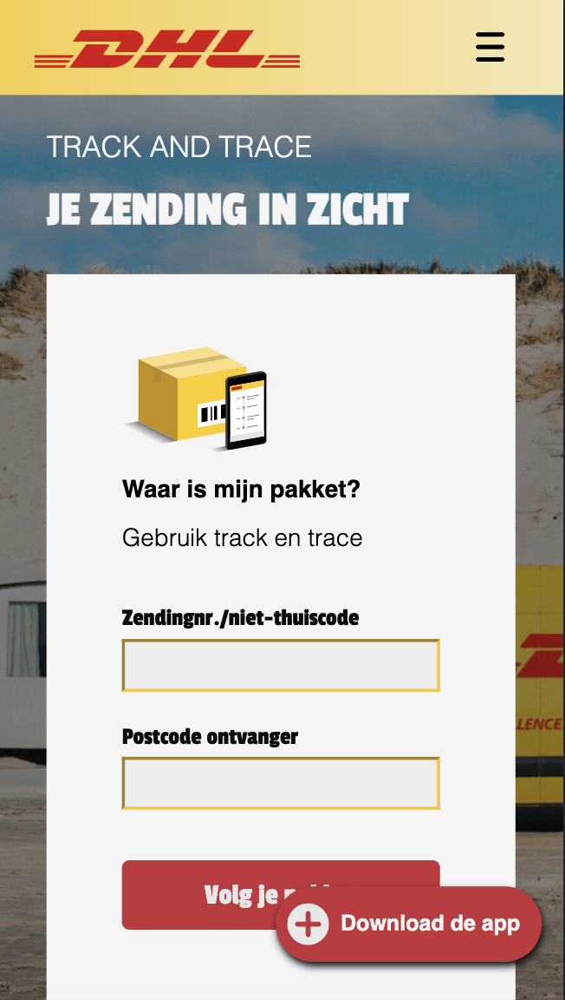
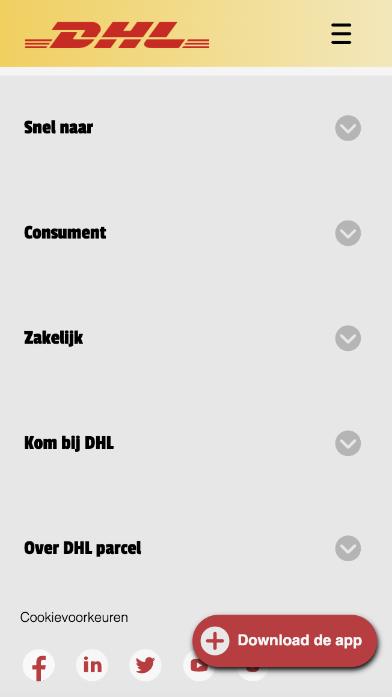

## Procesverslag van Larissa

  
uitwerken voor kick-off werkgroep

  ### Auteur:
  Larissa van Rijn

  #### Je startniveau:
  Blauw

  #### Je focus:
  Responsive
 

## Mijn gekozen website

  
uitwerken voor kick-off werkgroep

  ### Je opdracht:
  https://www.dhlparcel.nl/nl

  #### Screenshot(s) van de eerste pagina (small screen): 
  hier de naam van de pagina  
  
  
  
  
  
  
  
  

  #### Screenshot(s) van de tweede pagina (small screen):
  hier de naam van de pagina  
  
  
  
  
  
  
  
  
 

## Toegankelijkheidstest 1/2 (week 1)

  
uitwerken na test in 1e werkgroep

  ### Bevindingen
  Lijst met mijn bevindingen die in de testen naar voren kwamen:
  (Voor de video's met de testen, bekijk de folder images/toegankelijkheidstesten)

  Screenreader
  • Knoppen worden als afbeeldingen aangeroepen.
  • Afbeeldingen hebben geen duidelijke naam.
  • Belangrijke gedeeltes worden overgeslagen.

  Muis en toetsenbord
  • Gedeeltes worden overgeslagen.
  • Tab (focus vormgeving) is goed zichtbaar.
  • Taal selecteren wordt overgeslagen.

  Concentratie
  • Een ballon hoog houden en door de website heen gaan was aardig goed te doen.

  Motoriek (elastiekjes)
  • Met elastiekjes en een muis, was de website nog goed te gebruiken.

  Visueel (+ brillen)
  • Met de brillen (oogproblemen) was alles nog wel leesbaar en elementen snel te onderscheiden van elkaar.
  • Zwart/wit contrast is soms te weinig op gedeeltes waar wit op geel valt.
  • Contrasten van andere limieten met kleuren, zijn wel leesbaar.
  

  #### Screenreader 
  
  Met de screenreader had Koen Dekker de DHLparcel website getest. Wat er naar voren kwam, was dat bepaalde knoppen aangeroepen worden als afbeeldingen.
  Specifiek de optie om te zoeken doormiddel van het vergrootglas. Ook hadden bepaalde afbeeldingen geen duidelijke naam, waardoor je niet wist waar de afbeelding over ging.
  Op een van de pagina's werd er zelfs een belangrijke sectie overgeslagen en kon je niet op komen met het gebruik van de TAB.

  Dit kan opgelost worden door knoppen opgeroept worden als knoppen en niet als afbeeldingen. In deze context dus de zoekfunctie (vergrootglas). Zo krijgt de gebruiker de juiste informatie en dat het interactief is.
  Afbeeldingen moeten een duidelijke naam en omschrijving hebben, die goed uitlegd wat er op de afbeelding te zien is.
  Alle secties moeten bereikbaar zijn via de screenreader. Dit is op te lossen door het zo te programmeren dat het duidelijk word voor de screenreader dat er nog een sectie tussenstaat en even belangrijk is.

  #### Muis en Toetsenbord 
  
  Doormiddel van de TAB werden sommige secties overgeslagen. Wel was de richting van de TAB fijn en ging die niet door alle menu opties heen.
  De Tab (focus omgeving) was voor het meerderdeel leesbaar, behalve op bepaalde knoppen in de footer. Wel word de taalselectie in de header overgeslagen.

  Dit kan opgelost worden door de TAB geen secties meer over te laten slaan en deze beter te programmeren en bijpassende informatie aan deze secties te geven, dat het overslaan niet meer van toepassing is.
  De focusomgeving van de TAb kan nu zo nog aangepast worden dat het op alle knoppen goed te zien is, waar de focus zich bevind.
  Voor de taalselectie moet deze zo aangepast worden dat het bij deze ook TAB baar is en niet meer overgeslagen word.

  #### Motoriek (shocks, elastiekjes)
  
  Met het testen van motoriek had ik aan Koen 2 elastiekjes gegeven, die hij aan iedere hand om zijn wijsvinger, middelvinger en ringvinger moest binden.
  Hier kwam naar voren dat de website eigenlijk zo best goed te gebruiken was. Wel gebruikte Koen een muis, maar had hier geen moeite mee en kon de website prima bedienen.

  Hier zijn dus geen oplossingen voor nodig.

  #### Concentratie (ballon)
  
  Ook hadden we getest met een ballon en hoe deze de concentratie zou afnemen van de website. Toen Koen de ballon aan het hoog houden was, navigeerde hij nog prima door de website heen en kon zelfs zijn pakketnummer invoeren.
  Hij zei dat dit kwam, omdat de informatie precies lang en informatief genoeg is, waardoor hij snel wist waar hij overal moest zijn om zijn taak te vervullen.

  Hier zijn dus geen oplossingen voor nodig.

  #### Visueel (brillen, contrast, kleurenblind). 
  
  Als laatst gingen we testen met een visuele beperking. Hier gaf ik aan Koen een bril die de beperking liet zien van iemand met diabetic eye disease. 
  Tijdens het gebruiken van de bril, ondervond hij niet echt visuele problemen en kon hij alles prima lezen.
  Verder hadden wij nog getest op kleurenblindheid en hoe hij deze ondervond tijdens het gebruik van de website. Het enige waar hij soms moeite mee had in de setting zwart/wit, was dat sommige witte/gele knoppen niet echt leesbaar waren op een gele/witte achtergrond.

  Hoe de witte/gele knoppen opgelost kunnen worden, is door deze meer contrast te geven als ze op een gele/witte achtergrond staan. zo worden ze veel beter leesbaar.

## Breakdownschets (week 1)

  
uitwerken na afloop 2e werkgroep

  ### Pagina 1: 
  

  ### Pagina 2: 
  

## Voortgang 1 (week 2)

  
uitwerken voor 1e voortgang

  ### Stand van zaken
Wat best goed ging, was het netjes naast elkaar krijgen van elementen doormiddel van flexbox. Ik had wel een paar momenten dat ik wat meer moeite had met het vinden 
van de goede selectoren, om deze vorm te geven. Het is alleen niet gelukt om de footer af te krijgen, voor het gesprek. Verder had ik niet veel moeite met de code en het opstellen hiervan.

  ### Agenda voor meeting
  samen met je groepje opstellen

  | Larissa        | Lars               | Yasmine      | ---------        |
  | ---            | ---                | ---          | ---              |
  | div of section | Nog niks           | Nog niks     | ---------        |
  | ben op schema? | Nog niks           | Nog niks     | ---------        |
  | ...            | ...                | ...          | ...              |

  ### Verslag van meeting
  - Articles kunnen beter vervangen worden door sections
  - Er staan veel sections in sections die best weg mogen
  - Divjes kunnen beter als section, ookal krijg je daar een warning van over de headings.

## Voortgang 2 (week 3)

  
uitwerken voor 2e voortgang

  ### Stand van zaken
  Wat er goed ging was dat ik alle css toegepast heb op alle 2 de pagina's. Waar ik nog wel moeite mee had, was het toepassen van javascript op elementen die het nodig hebben (zoals het uitklapbare menu). Ik wil hier in het weekend meer tijd in steken + de website responsive hebben.
  Verder wil ik verschillende states erin zetten en als het lukt, leuke animaties erin verwerken.

  ### Agenda voor meeting

  | Larissa               | Lars               | Yasmine               |
  | ---                   | ---                | ---                   |
  | Divs goed toegepast?  | Niet bekend        | Vraag over articles   |
  | CSS logisch ingedeeld?| Niet bekend        | Vraag over Divs       | 
  | ...                   | ...                | ...                   |

  ### Verslag van meeting
  hier na afloop snel de uitkomsten van de meeting vastleggen

  - Divs kunnen weg in header door margin:auto op de DHL image te zetten.
  - Uitklappen list kan door html tag: Details
  - Knop van download de app kan de div weg door: main > a direct aan te roepen.
  - Voeg een label toe aan de form
  - Alle a’tjes linken naar de tegenovergestelde pagina.
  - Maak de hamburger een button

## Toegankelijkheidstest 2/2 (week 4)

  
uitwerken na test in 8e werkgroep

  ### Bevindingen
  De bevindingen die bij mij naar boven waren dat:
  
  Screenreader:
  - De website zegt 2X wat er in de eerste sectie staat.
  - 'Bekijk meer' word gezegd op knoppen, terwijl er iets anders staat.
  - Afbeeldingen moeten duidelijker worden wat slaat op de tekst ernaast.
  - 'Klikbaar icon van dit bedrijf' is een betere benaming dan 'afbeelding bedrijf'.
  - 'vul ..... in' is duidelijker om te gebruiken in het formulier.
  - HTML structuur stond niet netjes met headings.
  - Display hidden/none gebruiken voor onzichtbare rare button midden in header.

  Muis en toetsenbord:
  - In de nav word de hamburger button weergeven, terwijl deze niet zichtbaar is.
  - Er is nog geen vormgeving voor focus toegepast.

  Motoriek (elastiekjes):
  - Scrollen op een laptop is nog lastig, maar op buttons/linkjes drukken gaat prima.

  Visueel (brillen):
  - (Gele kleur bril) Licht grijze gebieden zijn niet te onderscheiden met de gele kleuren bril.
  - (Bril met kleine kijkhoek) Website is goed leesbaar door de 2 koloms grid en grote content.

  #### Screenreader
  Door het gebruik van de screenreader kwam ik erachter dat er aardig nog wat elementen waren die niet goed of netter overgebracht zouden kunnen worden. 
  Dit waren:
  - De website zegt 2X wat er in de eerste sectie staat.
  - 'Bekijk meer' word gezegd op knoppen, terwijl er iets anders staat.
  - Afbeeldingen moeten duidelijker worden wat slaat op de tekst ernaast.
  - 'Klikbaar icon van dit bedrijf' is een betere benaming dan 'afbeelding bedrijf'.
  - 'vul ..... in' is duidelijker om te gebruiken in het formulier.
  - HTML structuur stond niet netjes met headings.
  - Display hidden/none gebruiken voor onzichtbare rare button midden in header.

  Ik ga dit oplossen door te kijken naar:
  - Welke secties ik de ALT beter weg kan halen, aangezien dit dubbel gezegd word.
  - De tekst met 'bekijk meer' van knoppen aan te passen naar wat relevants die bij de knop hoort.
  - Afbeeldingen meer relevante ALT tekst te geven die aanslaat op de tekst die erbij hoort.
  - Iconen een beter begrijpbare ALT tekst te geven.
  - De ALT van het formulier nog duidlijker te maken wat er precies ingevuld moet worden.
  - De HTML Headings heb ik nu aangepast, zodat dit netjes weergeven word.
  - De button in de header heb ik gefixed nu door de button element weg te halen en alleen de IMG te gebruiken in de HTML. 

  #### Muis en Toetsenbord 
  Met het testen van de muis en het toetsenbord, kwam ik erachter dat de tab een onzichtbare button liet zien in de header en nog geen vormgeving had toegepast voor :focus elementen.
 
  De missende vormgeving voor de focus state los ik op door een focus element toe te passen op iedere interactieve element. De button in de header heb ik gefixed nu door de button element weg te halen en alleen de IMG te gebruiken in de HTML.

  #### Motoriek (shocks, elastiekjes)
  Ik had getest met elastiekjes en kwam erachter dat scrollen zonder muis nog best lastig is, maar dat de knoppen goed bereikbaar en drukbaar waren.

  Hier had ik niks wat aangepast moest worden.

  #### Visueel (brillen, contrast, kleurenblind, dark/light). 
  Hier had ik getest met een bril die gele glazen had en een bril die een heel klein percentage (2 kleine gaatjes) liet zien. Met de gele glazen kwam naar voren dat lichtgrijze gebieden niet te onderscheiden waren met de achtergrond. De bril met de kleine gaatjes liet mij zien dat de secties in de website goed leesbaar waren, omdat dit in een 2koloms grid bevond en groot afgebeeld was.

  Het probleem met de gele glazen kan ik oplossen door de lichtgrijze gebieden wat donkerder te maken, waardoor er meer contrast ontstaat en beter te onderscheiden word. Er was geen probleem ontstaan met de andere bril.

## Voortgang 3 (week 4)

  
uitwerken voor 3e voortgang

  ### Stand van zaken
  Ik was deze week veel bezig met het responsive maken van de website en subtiele hovers toe te voegen. Verder was ik bezig met animaties. Ook liep ik nergens echt tegenaan.
  Wat ik de aankomende week nog wil uitwerken is meerdere states toevoegen, netheid van de code nakijken, animaties toevoegen, checken op toegankelijkheid en het hamburger menu aanpassen in de html. 

  ### Agenda voor meeting
  samen met je groepje opstellen

  | Larissa                         | Yasmine            | Lars         | 
  | ---                             | ---                | ---          | 
  | Hoe TAB focus border aanpassen  | Onbekend           | Onbekend     |
  | Divs logisch gebruikt met class |                    |              | 
  | Warnings sections erg?          |                    |              | 
  |                                 | ...                | ...          | 

  ### Verslag van meeting
  hier na afloop snel de uitkomsten van de meeting vastleggen

  - Een outline gebruiken op alle interactieve:focus elementen om de border aan te passen.
  - White-space:no-wrap voor download button gebruiken, zodat deze netjes doorloopt.
  - Voor knoppen die te lang zijn met de a: Width: min-content;, White-space: no-wrap;
  - Op de auto een audiofile afspelen dat die toetert, doormiddel van javascript.

## Eindgesprek (week 5)

  
uitwerken voor eindgesprek

  ### Je uitkomst - karakteristiek screenshots:
  
  
  

  
  
  

  
  
  

  
  
  

  
  
  

  ### Dit ging goed/Heb ik geleerd: 
  Wat goed ging was kleine elementen toepassen die ik nog niet eerder heb gebruikt, zoals animaties, states, een goed UX formulier en de details tag.
  
  
  

  Ik vond deze erg leuk om te gebruiken en daarmee een leuke website mee op te bouwen.

  Ook het responsive maken van de website vond ik erg interessant. In het begin moest ik er goed naar kijken hoe ik bepaalde grids/flexboxes moest gebruiken, maar uiteindelijk was het toch gelukt.
  Wat ik ook heb geleerd is hoe belangrijk het is om goede UX te gebruiken, vooral in de HTML files aangezien dit super belangrijk is voor mensen met een screenreader. Ik wist niet dat het zo belangrijk zou zijn en heb hier veel van geleerd.

  Wat heb ik veranderd voor betere toegankelijkerheid?
  Voor de screenreader:
  - Bepaalde elementen heb ik de ALT weggehaald, aangezien dit dubbel gezegd word.
  - De tekst met 'bekijk meer' van knoppen heb ik aangepast naar wat relevants die bij de knoppen horen.
  - Afbeeldingen heb ik meer relevante ALT tekst geven die aanslaat op de tekst die erbij hoort.
  - Iconen een beter begrijpbare ALT tekst geven.
  - De HTML Headings heb ik nu aangepast, zodat dit netjes weergeven word.
  - De button in de header heb ik gefixed nu door de button element weg te halen en alleen de IMG te gebruiken in de HTML. 

  Voor de testen met de gele bril en de kleine gaten bril:
  - Lichtgrijze gebieden waren te licht en had te weinig contrast. Deze heb ik nu wat donkerder gemaakt, zodat het contrast hoger is.

  ### Dit was lastig/Is niet gelukt:
  Wat ik wat lastig vond was het laten werken van het hambuger menu. Ik had meer moeite met het begrijpen hoe het werkte dan de code zelf. Uiteindelijk had ik er een video erbij gepakt om beter te begrijpen hoe het werkte, en snappte ik het uiteindelijk wel.
  Wat niet gelukt was met het hamburger menu, was dat je er met TAB doorheen kon gaan. Helaas door het gebrek aan tijd, had ik dit niet meer uit kunnen vogelen. Ook had ik dit liever als span wilen aanroepen in plaats van een IMG.
  
  Als laatst wat niet gelukt was, was het toevoegen van een transition op de details tag, zodat deze wat smoother opengaat.
 

  Wat ik had gedaan als ik meer tijd had gehad, is lazers toegevoegd, nog meer animaties hebben toegepast, beter gekeken hebben of de code die ik heb geschreven korter kan (CSS) of netter en bepaalde elementen nog netter hebben neergezet.

## Bronnenlijst

  
continu bijhouden terwijl je werkt

  1. Video over hoe een hamburger menu werkt (had hier met de opdrachten nog moeite mee en moest dit 'live' even zien om het goed te begrijpen): https://www.youtube.com/watch?v=1iS0r238G4g
  2. Video over hoe ik een scroll in effect met javascript kon toepassen: https://www.youtube.com/watch?v=T33NN_pPeNI
  3. Codepen bestand over hoe je een audiofile op een IMG kan zetten: https://codepen.io/aamnah/pen/gazjYa
  4. Soundeffect wat ik heb gebruikt voor het toeteren: https://pixabay.com/sound-effects/?utm_source=link-attribution&amp;utm_medium=referral&amp;utm_campaign=music&amp;utm_content=6188

