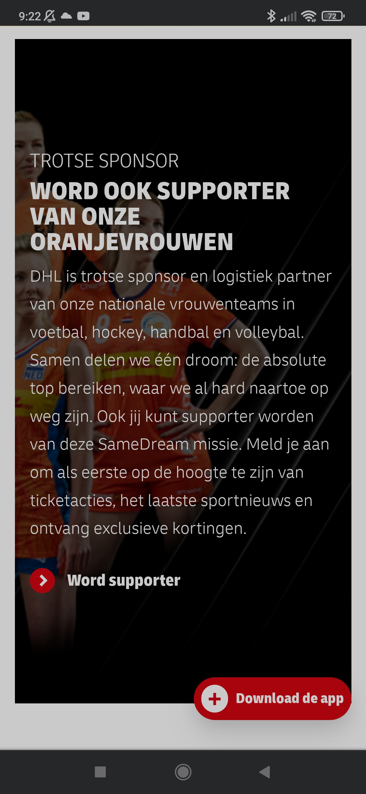

# Procesverslag
Markdown is een simpele manier om HTML te schrijven.  
Markdown cheat cheet: [Hulp bij het schrijven van Markdown](https://github.com/adam-p/markdown-here/wiki/Markdown-Cheatsheet).

Nb. De standaardstructuur en de spartaanse opmaak van de README.md zijn helemaal prima. Het gaat om de inhoud van je procesverslag. Besteedt de tijd voor pracht en praal aan je website.

Nb. Door *open* toe te voegen aan een *details* element kun je deze standaard open zetten. Fijn om dat steeds voor de relevante stuk(ken) te doen.

## Jij

  
uitwerken voor kick-off werkgroep

  ### Auteur:
  Larissa van Rijn

  #### Je startniveau:
  Blauw

  #### Je focus:
  Responsive
 

## Je website

  
uitwerken voor kick-off werkgroep

  ### Je opdracht:
  https://www.dhlparcel.nl/nl

  #### Screenshot(s) van de eerste pagina (small screen): 
  hier de naam van de pagina  
  
  
  
  
  
  
  
  

  #### Screenshot(s) van de tweede pagina (small screen):
  hier de naam van de pagina  
  
  
  
  
  
  
  
  
 

## Toegankelijkheidstest 1/2 (week 1)

  
uitwerken na test in 1e werkgroep

  ### Bevindingen
  Lijst met mijn bevindingen die in de testen naar voren kwamen:
  (Voor de video's met de testen, bekijk de folder images/toegankelijkheidstesten)

  Screenreader
  • Knoppen worden als afbeeldingen aangeroepen.
  • Afbeeldingen hebben geen duidelijke naam.
  • Belangrijke gedeeltes worden overgeslagen.

  Muis en toetsenbord
  • Gedeeltes worden overgeslagen.
  • Tab (focus vormgeving) is goed zichtbaar.
  • Taal selecteren wordt overgeslagen.

  Concentratie
  • Een ballon hoog houden en door de website heen gaan was aardig goed te doen.

  Motoriek (elastiekjes)
  • Met elastiekjes en een muis, was de website nog goed te gebruiken.

  Visueel (+ brillen)
  • Met de brillen (oogproblemen) was alles nog wel leesbaar en elementen snel te onderscheiden van elkaar.
  • Zwart/wit contrast is soms te weinig op gedeeltes waar wit op geel valt.
  • Contrasten van andere limieten met kleuren, zijn wel leesbaar.
  

  #### Screenreader 
  Met de screenreader had Koen Dekker de DHLparcel website getest. Wat er naar voren kwam, was dat bepaalde knoppen aangeroepen worden als afbeeldingen.
  Specifiek de optie om te zoeken doormiddel van het vergrootglas. Ook hadden bepaalde afbeeldingen geen duidelijke naam, waardoor je niet wist waar de afbeelding over ging.
  Op een van de pagina's werd er zelfs een belangrijke sectie overgeslagen en kon je niet op komen met het gebruik van de TAB.

  Dit kan opgelost worden door knoppen opgeroept worden als knoppen en niet als afbeeldingen. In deze context dus de zoekfunctie (vergrootglas). Zo krijgt de gebruiker de juiste informatie en dat het interactief is.
  Afbeeldingen moeten een duidelijke naam en omschrijving hebben, die goed uitlegd wat er op de afbeelding te zien is.
  Alle secties moeten bereikbaar zijn via de screenreader. Dit is op te lossen door het zo te programmeren dat het duidelijk word voor de screenreader dat er nog een sectie tussenstaat en even belangrijk is.

  #### Muis en Toetsenbord 
  Doormiddel van de TAB werden sommige secties overgeslagen. Wel was de richting van de TAB fijn en ging die niet door alle menu opties heen.
  De Tab (focus omgeving) was voor het meerderdeel leesbaar, behalve op bepaalde knoppen in de footer. Wel word de taalselectie in de header overgeslagen.

  Dit kan opgelost worden door de TAB geen secties meer over te laten slaan en deze beter te programmeren en bijpassende informatie aan deze secties te geven, dat het overslaan niet meer van toepassing is.
  De focusomgeving van de TAb kan nu zo nog aangepast worden dat het op alle knoppen goed te zien is, waar de focus zich bevind.
  Voor de taalselectie moet deze zo aangepast worden dat het bij deze ook TAB baar is en niet meer overgeslagen word.

  #### Motoriek (shocks, elastiekjes)
  Met het testen van motoriek had ik aan Koen 2 elastiekjes gegeven, die hij aan iedere hand om zijn wijsvinger, middelvinger en ringvinger moest binden.
  Hier kwam naar voren dat de website eigenlijk zo best goed te gebruiken was. Wel gebruikte Koen een muis, maar had hier geen moeite mee en kon de website prima bedienen.

  Hier zijn dus geen oplossingen voor nodig.

  #### Concentratie (ballon)
  Ook hadden we getest met een ballon en hoe deze de concentratie zou afnemen van de website. Toen Koen de ballon aan het hoog houden was, navigeerde hij nog prima door de website heen en kon zelfs zijn pakketnummer invoeren.
  Hij zei dat dit kwam, omdat de informatie precies lang en informatief genoeg is, waardoor hij snel wist waar hij overal moest zijn om zijn taak te vervullen.

  Hier zijn dus geen oplossingen voor nodig.

  #### Visueel (brillen, contrast, kleurenblind). 
  Als laatst gingen we testen met een visuele beperking. Hier gaf ik aan Koen een bril die de beperking liet zien van iemand met diabetic eye disease. 
  Tijdens het gebruiken van de bril, ondervond hij niet echt visuele problemen en kon hij alles prima lezen.
  Verder hadden wij nog getest op kleurenblindheid en hoe hij deze ondervond tijdens het gebruik van de website. Het enige waar hij soms moeite mee had in de setting zwart/wit, was dat sommige witte/gele knoppen niet echt leesbaar waren op een gele/witte achtergrond.

  Hoe de witte/gele knoppen opgelost kunnen worden, is door deze meer contrast te geven als ze op een gele/witte achtergrond staan. zo worden ze veel beter leesbaar.

## Breakdownschets (week 1)

  
uitwerken na afloop 2e werkgroep

  ### Pagina 1: 
  

  ### Pagina 2: 
  

## Voortgang 1 (week 2)

  
uitwerken voor 1e voortgang

  ### Stand van zaken
  hier dit ging goed & dit was lastig (neem ook screenshots op van delen van je website en code)

  ### Agenda voor meeting
  samen met je groepje opstellen

  | student 1      | student 2          | student 3    | student 4        |
  | ---            | ---                | ---          | ---              |
  | dit bespreken  | en dit             | en ik dit    | en dan ik dat    |
  | en dat ook nog | dit als er tijd is | nog een punt | dit wil ik zeker |
  | ...            | ...                | ...          | ...              |

  ### Verslag van meeting
  hier na afloop snel de uitkomsten van de meeting vastleggen

  - punt 1
  - punt 2
  - nog een punt
  - ...

## Voortgang 2 (week 3)

  
uitwerken voor 2e voortgang

  ### Stand van zaken
  hier dit ging goed & dit was lastig (neem ook screenshots op van delen van je website en code)

  ### Agenda voor meeting
  samen met je groepje opstellen

  | student 1      | student 2          | student 3    | student 4        |
  | ---            | ---                | ---          | ---              |
  | dit bespreken  | en dit             | en ik dit    | en dan ik dat    |
  | en dat ook nog | dit als er tijd is | nog een punt | dit wil ik zeker |
  | ...            | ...                | ...          | ...              |

  ### Verslag van meeting
  hier na afloop snel de uitkomsten van de meeting vastleggen

  - punt 1
  - punt 2
  - nog een punt
- ...

## Toegankelijkheidstest 2/2 (week 4)

  
uitwerken na test in 8e werkgroep

  ### Bevindingen
  Lijst met je bevindingen die in de test naar voren kwamen (geef ook aan wat er verbeterd is):

  #### Screenreader
  Hier korte omschrijving (met indien nodig afbeeldingen)

  Hier een omschrijving van hoe het opgelost kan worden (met indien nodig afbeeldingen)

  #### Muis en Toetsenbord 
  Hier korte omschrijving (met indien nodig afbeeldingen)

  Hier een omschrijving van hoe het opgelost kan worden (met indien nodig afbeeldingen)

  #### Motoriek (shocks, elastiekjes)
  Hier korte omschrijving (met indien nodig afbeeldingen)

  Hier een omschrijving van hoe het opgelost kan worden (met indien nodig afbeeldingen)

  #### Visueel (brillen, contrast, kleurenblind, dark/light). 
  Hier korte omschrijving (met indien nodig afbeeldingen)

  Hier een omschrijving van hoe het opgelost kan worden (met indien nodig afbeeldingen)

## Voortgang 3 (week 4)

  
uitwerken voor 3e voortgang

  ### Stand van zaken
  hier dit ging goed & dit was lastig (neem ook screenshots op van delen van je website en code)

  ### Agenda voor meeting
  samen met je groepje opstellen

  | student 1      | student 2          | student 3    | student 4        |
  | ---            | ---                | ---          | ---              |
  | dit bespreken  | en dit             | en ik dit    | en dan ik dat    |
  | en dat ook nog | dit als er tijd is | nog een punt | dit wil ik zeker |
  | ...            | ...                | ...          | ...              |

  ### Verslag van meeting
  hier na afloop snel de uitkomsten van de meeting vastleggen

  - punt 1
  - punt 2
  - nog een punt
  - ...

## Eindgesprek (week 5)

  
uitwerken voor eindgesprek

  ### Je uitkomst - karakteristiek screenshots:
  

  ### Dit ging goed/Heb ik geleerd: 
  Korte omschrijving met plaatjes

  

  ### Dit was lastig/Is niet gelukt:
  Korte omschrijving met plaatjes

  

## Bronnenlijst

  
continu bijhouden terwijl je werkt

  Nb. Wees specifiek ('css-tricks' als bron is bijv. niet specifiek genoeg).

  1. bron 1
  2. bron 2
  3. ...

